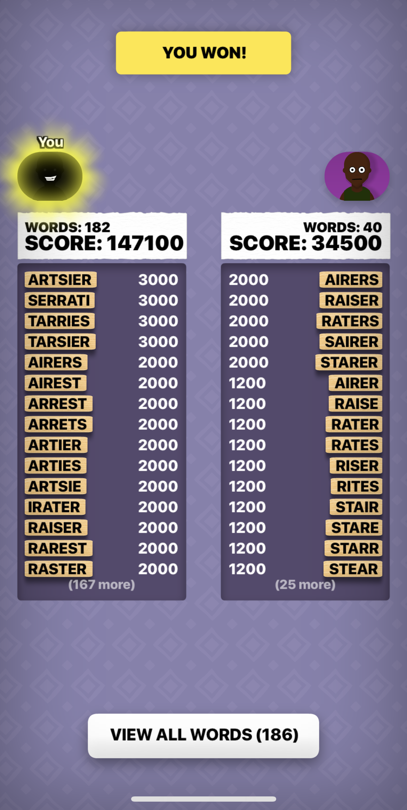

# Gamepigeon Anagrams Bot
Max out GamePigeon Anagrams games using iPhone mirroring!

**Steps**

1. Open the iPhone Mirroring app and launch a GamePigeon Anagrams game. Make sure you are on the screen with the start button.

2. Run the anagrams_solver executable (downloadable from the releases section on the right side of this page). You may need to grant your terminal permissions the first time.
3. Wait for the program to start! It usually takes around 20-30 seconds to load and start.
